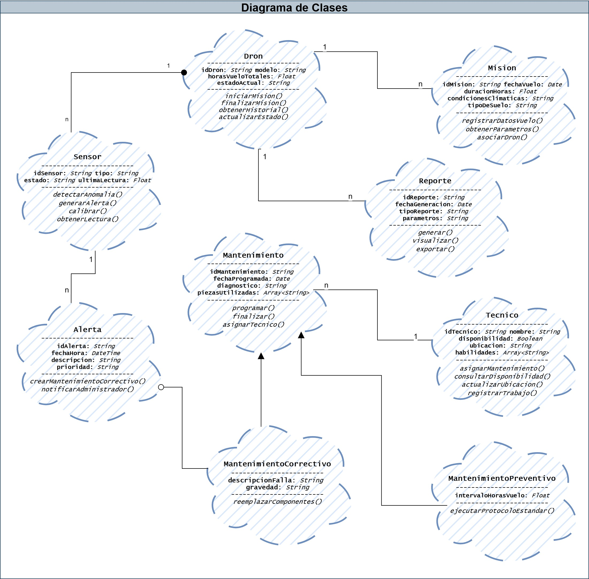
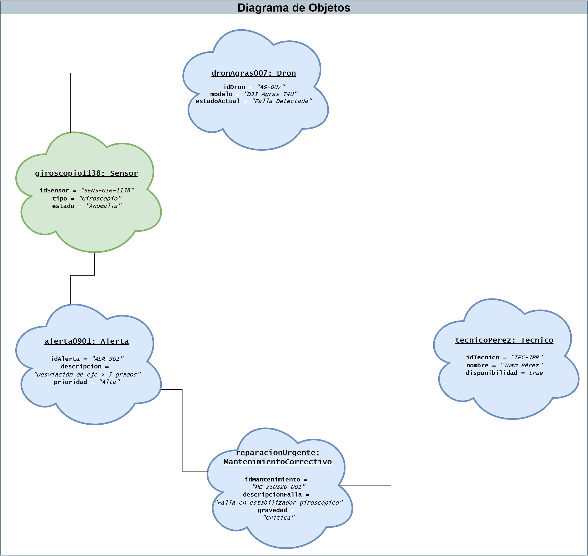

# 🚁 Proyecto: Metodología Booch - Sistema de Gestión de Mantenimiento de Drones

Este proyecto aplica la **metodología de diseño orientado a objetos de Grady Booch** para modelar la arquitectura de un sistema de software encargado de gestionar el mantenimiento de una flota de drones agrícolas para la empresa AGROTEC.

## 📝 Índice

1.  [Caso de Estudio](#1-caso-de-estudio-agrotec)
2.  [Diagramas del Modelo](#2-diagramas-del-modelo)
    -   [Diagrama de Clases](#diagrama-de-clases)
    -   [Diagrama de Objetos](#diagrama-de-objetos)
3.  [Archivos del Proyecto](#3-archivos-del-proyecto)
4.  [Instrucciones de Uso](#4-instrucciones-de-uso)

---

### **1. Caso de Estudio: AGROTEC**

La empresa AGROTEC enfrenta fallos imprevistos y altos costos debido a un proceso de mantenimiento de drones manual y no estandarizado. El objetivo de este proyecto es diseñar un sistema especializado que permita:
-   Registrar y monitorear cada dron.
-   Programar mantenimientos preventivos basados en datos reales (horas de vuelo, clima).
-   Generar alertas automáticas a partir de sensores.
-   Asignar técnicos de manera eficiente y generar reportes operativos.

### **2. Diagramas del Modelo**

A continuación se presentan los artefactos visuales diseñados con la notación de Booch.

#### **Diagrama de Clases**
Define la estructura estática del sistema, mostrando las clases principales, sus atributos, métodos y las relaciones entre ellas (herencia, posesión, uso y asociación).

#### **Diagrama de Objetos**
Muestra una "fotografía" del sistema en un momento específico, ilustrando instancias concretas de las clases y sus enlaces durante un escenario de "alerta de sensor".

### **3. Archivos del Proyecto**

-   `DDOO_U3_A1_FRSM.drawio`: Archivo fuente editable que contiene ambos diagramas.
-   `DDOO_U3_A1_FRSM_CLASS.jpg`: Imagen del diagrama de clases.
-   `DDOO_U3_A1_FRSM_OBJECT.jpg`: Imagen del diagrama de objetos.

### **4. Instrucciones de Uso**

Puedes dar en el link de arriba o para visualizar y editar el archivo fuente de los diagramas, siga estos pasos:

1.  Vaya al sitio web oficial de **[Draw.io (Diagrams.net)](https://app.diagrams.net/)**.
2.  En el menú, haga clic en `Archivo` > `Abrir desde` > `Dispositivo...`.
3.  Seleccione el archivo `DDOO_U3_A1_FRSM.drawio` de este directorio.
4.  El lienzo se cargará con ambos diagramas, listos para ser explorados o modificados.