

# 📱 Proyecto Final: Diseño de la App "Community" con UML y OCL

Este proyecto representa la Evidencia de Aprendizaje de la unidad, donde se aplica un conjunto de metodologías de modelado para diseñar la arquitectura completa de una aplicación móvil para la gestión de eventos llamada "Community".

## 📝 Índice

1.  [Caso de Estudio](#1-caso-de-estudio-community)
2.  [Artefactos del Diseño](#2-artefactos-del-diseño)
    -   [Diagramas de Modelado](#diagramas-de-modelado)
    -   [Wireframes (Diseño de Interfaz)](#wireframes-diseño-de-interfaz)
    -   [Reglas de Consistencia (OCL)](#reglas-de-consistencia-ocl)
3.  [Archivos y Herramientas](#3-archivos-y-herramientas)

---

### **1. Caso de Estudio: Community**

El objetivo es diseñar una aplicación móvil para una empresa organizadora de eventos. El sistema debe permitir a los **usuarios** buscar, seleccionar, reservar y pagar por eventos, mientras que los **administradores** deben poder gestionar los catálogos de servicios, lugares, organizadores y generar reportes.

### **2. Artefactos del Diseño**

A continuación, se presentan todos los artefactos visuales generados durante el proceso de análisis y diseño.

#### **Diagramas de Modelado**

| Diagrama                                   | Metodología | Descripción                                                               |
| ------------------------------------------ | :---------: | ------------------------------------------------------------------------- |
| **Clases Asociadas** |    Booch    | Muestra las 3 clases clave iniciales y su asociación.                     |
| 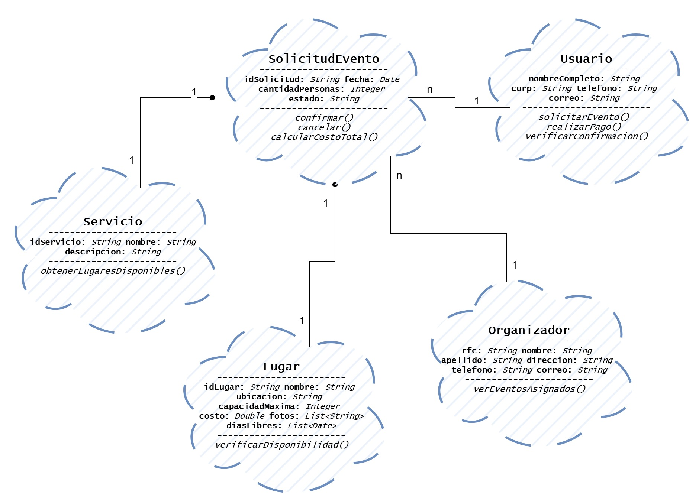  |             |                                                                           |
| **Casos de Uso** |    OOSE     | Define las interacciones entre los actores (`Usuario`, `Admin`) y el sistema.  |
| 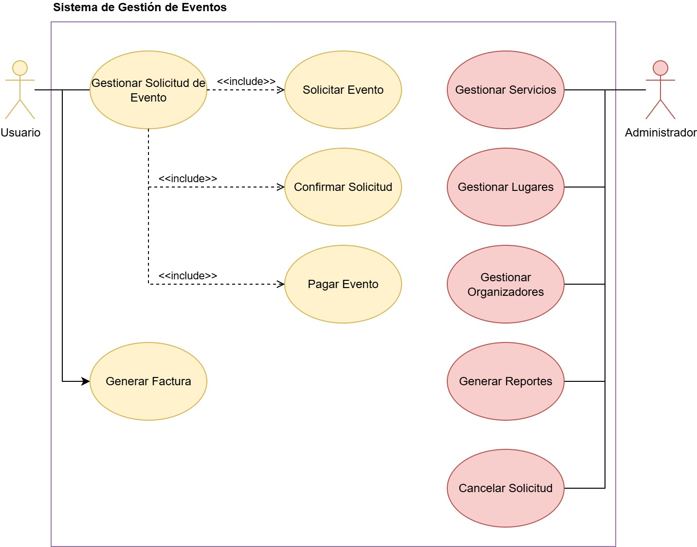    |             |                                                                           |
| **Flujo de Datos** |     OMT     | Ilustra cómo fluye la información durante el proceso de reserva.           |
| 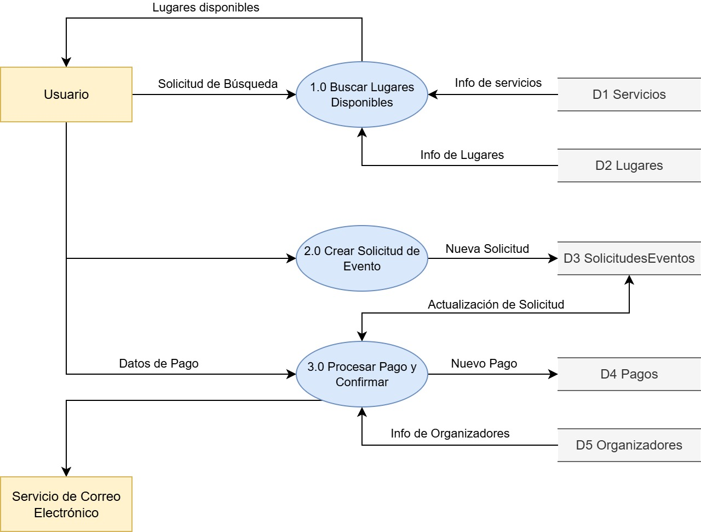      |             |                                                                           |
| **Diagrama de Clases Final** |     UML     | El modelo estructural completo del sistema, con herencia y composición.   |
| 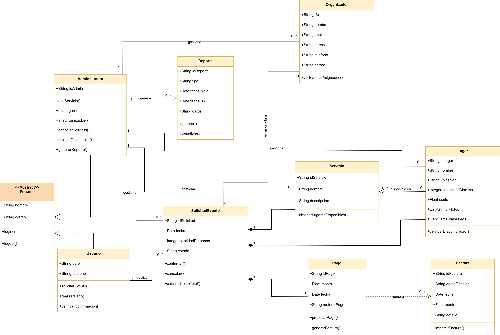      |             |                                                                           |

#### **Wireframes (Diseño de Interfaz)**

Se diseñó un flujo de usuario de 5 pantallas clave para el proceso de reserva en la aplicación móvil.

| Búsqueda y Resultados | Detalles del Lugar | Formulario de Reserva |
| :---: | :---: | :---: |
| 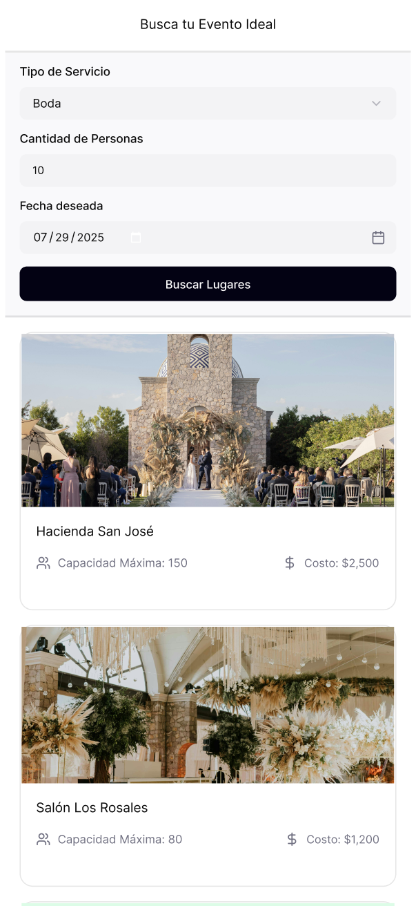 | 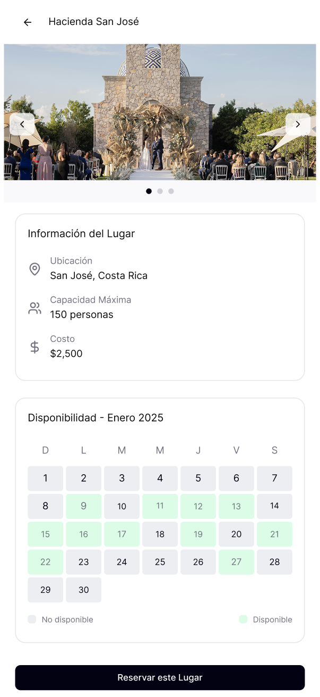 | 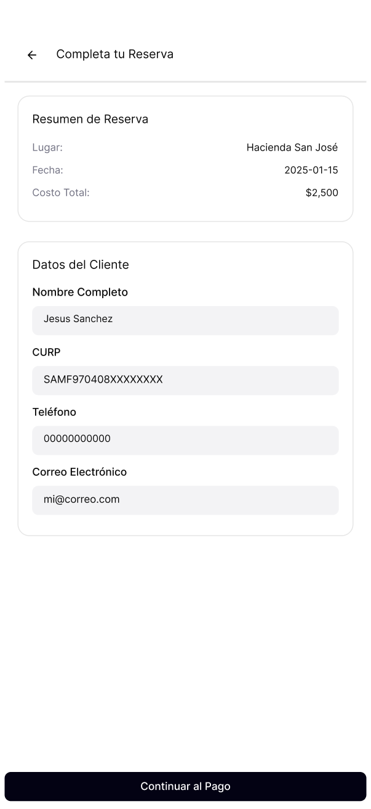 |
| **Pago** | **Confirmación** |
| 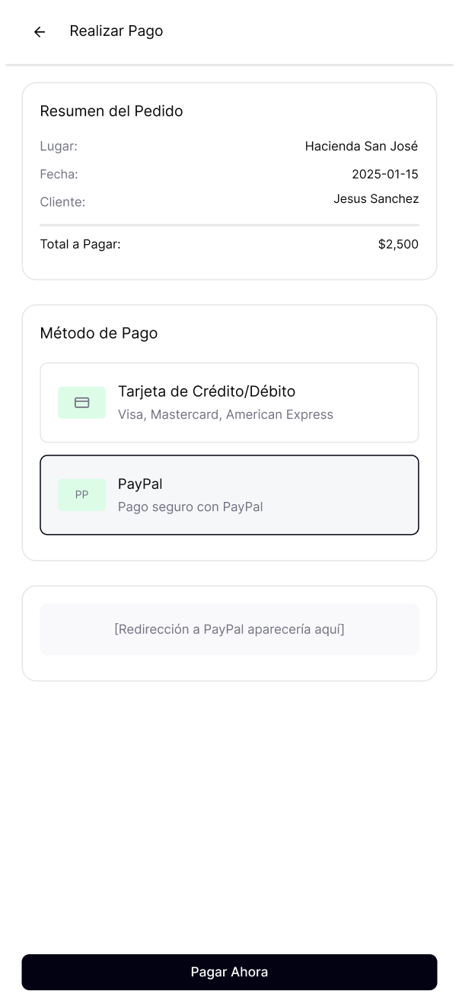 | 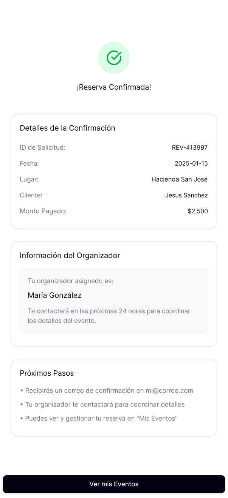 |

#### **Reglas de Consistencia (OCL)**

Se definieron reglas formales para asegurar la integridad del modelo.

| Regla                                       | Descripción                                                                 |
| ------------------------------------------- | --------------------------------------------------------------------------- |
| **Invariante de Clase** | Asegura que la capacidad del lugar sea suficiente para los asistentes.       |
| 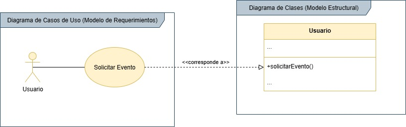    |                                                                             |
| **Consistencia (Caso de Uso -> Clase)** | Vincula la acción del actor en el Caso de Uso con un método en la Clase.     |
| 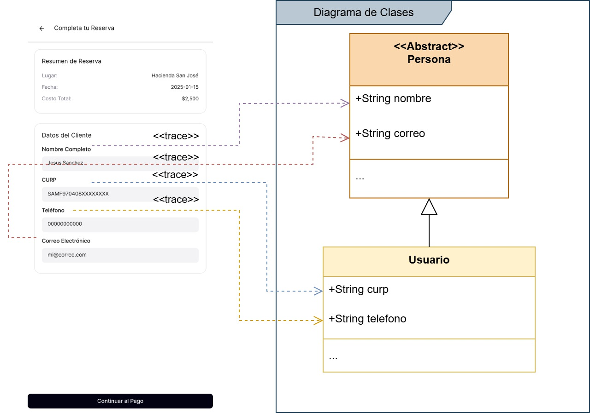   |                                                                             |

### **3. Archivos y Herramientas**

-   **Archivos Fuente (`.drawio`):** Todos los diagramas de modelado y las gráficas OCL se encuentran en la raíz de esta carpeta para ser editados con [Draw.io](https://app.diagrams.net/).
-   **Diseño de UI (Figma):** Los wireframes fueron diseñados en Figma. Puedes ver e interactuar con el prototipo a través de este enlace:
    -   [**Abrir Prototipo en Figma**](https://www.figma.com/design/8LVwS06qee6yEe2VGawN0Q/Community-Mobile-App?node-id=0-1&t=pMR1NIXkv8ahIkUF-1)